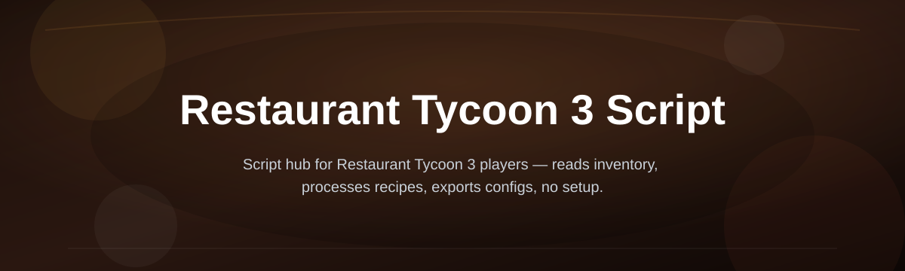
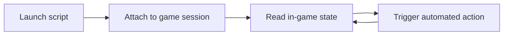

# restaurant-tycoon-3-script-hub

*A community-maintained Restaurant Tycoon 3 Script hub for players who want clear automation without digging through scattered Discord links.*

## What this is

This repository started the way a lot of small tools do: a handful of players in the Restaurant Tycoon 3 community kept sharing loose scripts, half-working forks, and outdated links to each other, and nobody had a single place to point new members. **restaurant-tycoon-3-script-hub** is that place — a maintained project page for a Restaurant Tycoon 3 Script, built and updated by contributors who actually play the game rather than by a faceless "tool factory."

The script itself focuses on the repetitive parts of running a restaurant in-game — collecting income, managing ingredient runs, and handling menial upgrade loops — so players can spend their time on layout design, staffing decisions, and the parts of the tycoon genre that are actually fun. It's distributed as a standalone Windows tool through the linked project page, with updates tracked here in the repo so the community can follow what changed and why.

  

The button above opens the project's landing page, where the current build of the tool is hosted for download.

## Who it is for

- **Players restarting a save** who want fewer clicks spent on repetitive income collection.
- **New contributors** looking for a small, friendly codebase to make a first pull request.
- **Community members** who track Restaurant Tycoon 3 updates and want a script that keeps pace with them.
- **Players testing layouts** who need automation running in the background while they iterate.
- **Discord community regulars** who got tired of re-sharing the same outdated download link.

## What you can do

- **Automate income collection** so registers and stations don't need manual clicking every cycle.
- **Track ingredient and stock levels** to reduce trips back to supply menus.
- **Queue routine upgrades** instead of babysitting the upgrade screen.
- **Follow a changelog** in this repo so you know what changed between builds.
- **Open issues for bugs** directly against the version you're running.
- **Pick up good-first-issues** tagged for new contributors in the Issues tab.
- **Join roadmap discussions** before features get built, not after.
- **Report game-side changes early** so the script adapts quickly when the game updates.

## Getting started

1. Open the [project landing page](https://Basinshifree.github.io/restaurant-tycoon-3-script-hub/).
2. Download the current build listed there.
3. Save it somewhere you can find it again — no installer is involved.
4. Run the file and follow the on-screen prompt to attach it to Restaurant Tycoon 3.
5. Launch the game and confirm the script's status indicator shows connected.

## Requirements

- Windows 10 or 11 (64-bit).
- Restaurant Tycoon 3 installed and able to launch normally.
- No build toolchain, package manager, or additional runtime needed — it's a standalone executable.
- A stable internet connection for the initial download from the landing page.

## How it works

The script sits between your inputs and the game's usual click-heavy loops, watching for the same conditions a player would react to and acting on them at normal, human-like intervals.

1. You launch the script after downloading it from the landing page.
2. It attaches to your running Restaurant Tycoon 3 session.
3. It reads visible in-game state — income ready, stock low, upgrade available.
4. It triggers the matching action on your behalf.
5. It loops back to step 3 for as long as the session is open.

## FAQ

**Is there a Restaurant Tycoon 3 Script that still works after game updates?**
Yes, this is exactly why the repo is community-maintained — when the game changes, contributors report it through Issues and the build gets adjusted rather than abandoned.

**Do I need to reinstall anything to use a Restaurant Tycoon 3 Script?**
No. The tool is a standalone Windows executable from the landing page; nothing gets installed into the game itself.

**Will this Restaurant Tycoon 3 Script work on Mac or mobile?**
Not currently. The project targets Windows 10/11 only; there's no Mac or mobile build.

**Can I request a feature for the Restaurant Tycoon 3 Script?**
Yes — open a discussion or issue describing the workflow you want automated, and it can be considered for the roadmap.

**Is this Restaurant Tycoon 3 Script safe to run alongside the game?**
It's built to run as a normal background Windows application. As with any third-party tool, only download it from the linked landing page, not mirrors.

## Troubleshooting

- **Script won't attach to the game:** Make sure Restaurant Tycoon 3 is already open before you launch the script, then relaunch the script.
- **Status indicator stays disconnected:** Close both the game and the script, reopen the game first, then start the script again.
- **Download from the landing page fails:** Check your connection and browser download permissions; try again after a browser restart.
- **Actions seem delayed or skipped:** This is usually normal pacing to avoid unnatural-looking clicks; if it persists across sessions, open an issue with your build version.

## License

This project is licensed under the [MIT License](LICENSE). It's an independent, community-built tool and is not affiliated with or endorsed by the developers of Restaurant Tycoon 3. Use it at your own discretion.

  

